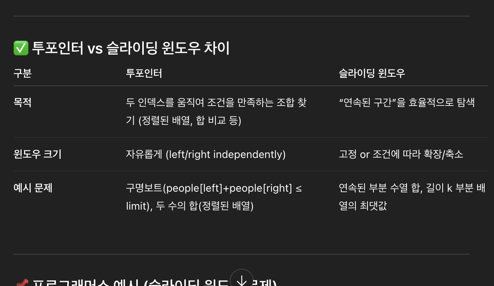

## JS 코딩 테스트 핵심 패턴

### 1. 투 포인터

배열의 양 끝이나 특정 위치에서 시작하여 조건에 따라 포인터를 이동시키는 기법

O(n^2)문제를 O(n)으로 줄이는 방법

만약 문제에서 **"정렬된 배열"** 이라는 게 있으면 투 포인터를 먼저 떠올리면 좋습니다

```js
// 두 수의 합
function twoSum(nums, target) {
  let left = 0;
  let right = nums.length - 1;

  while (left < right) {
    const sum = nums[left] + nums[right];
    if (sum === target) {
      return [left, right];
    } else if (sum < target) {
      left++;
    } else {
      right--;
    }
  }
  return [-1, -1];
}

console.log(twoSum([1, 2, 7, 11, 15], 9));
```

```js
// 팰린드롬 검사
function isPalindrom(s) {
  let left = 0;
  let right = s.length - 1;

  while (left < right) {
    if (s[left] !== s[right]) {
      return false;
    }
    left++;
    right--;
  }
  return true;
}
console.log(isPalindrome("racecar"));
```

### 2. 슬라이딩 윈도우

- 연속된 구간(subarray, substring)의 합, 평균, 개수를 구할때 사용
- window 크기를 고정시키거나 조건에 따라 가변적으로 이동시킨다
- 매번 처음부터 다시 계산하지 않고, 왼쪽 값을 빼고 오른쪽 값을 더하는 방식으로 효율화

**부분배열**이라는 단어가 오면 해당 알고리즘을 떠올립니다
이전 합에서 왼쪽 값을 빼고, 새로 들어온 오른쪽 값을 더하는 것이 핵심

투포인터와의 차이로는 아래와 같습니다



```js
function solution(elements) {
  const n = elements.length;
  const arr = elements.concat(elements); // 배열 2배로 늘리기
  const sums = new Set();

  for (let len = 1; len <= n; len++) {
    // 부분 수열 길이
    // 초기 윈도우 합 계산
    let sum = 0;
    for (let i = 0; i < len; i++) sum += arr[i];
    sums.add(sum);

    // 슬라이딩 윈도우 이동
    for (let start = 1; start < n; start++) {
      sum = sum - arr[start - 1] + arr[start + len - 1]; // 왼쪽 빼고 오른쪽 더함
      sums.add(sum);
    }
  }

  return sums.size;
}
```

```js
// 가변 크기 윈도우 - 최소길이
function minSubarrayLen(target, nums) {
  let left = 0;
  let sum = 0;
  let minLen = Infinity;

  for (let right = 0; right < nums.length; right++) {
    sum += nums[right];

    while (sum >= target) {
      minLen = Math.min(minLen, right - left + 1);
      sum -= nums[left];
      left++;
    }
  }

  return minLen === Infinity ? 0 : minLen;
}

console.log(minSubarrayLen(7, [2, 3, 1, 2, 4, 3])); // 2 (4+3)
```

### 3. 해시맵 활용 패턴

빈도 계산, 중복 확인, 매핑 등에 사용됩니다

```js
function characterFrequency(str) {
  const freq = {};

  for (const char of str) {
    freq[char] = (freq[char] || 0) + 1;
  }

  return freq;
}

console.log(characterFrequency("hello")); // {h: 1, e: 1, l: 2, o: 1}
```

애너그램 검사의 경우에는 2개의 문자열을 돌면서 1번 문자열은 카운트 증가, 2번 문자열은 카운트를 감소시켜 모든 count가 0이면 됩니다

### 4. 스택 활용 패턴

LIFO 특성을 활용합니다.
마지막에 넣은 걸 먼저 처리해야 하는 문제의 경우 -> "스택"을 사용

- 최근 상태 / undo
- DFS
- 괄호 / 중첩 구조
- 문자열 뒤집기 / 후위 표기식

```js
function isValid(s) {
  const stack = [];
  const pairs = {
    ")": "(",
    "}": "{",
    "]": "[",
  };

  for (const char of s) {
    if (char in pairs) {
      if (stack.pop() !== pairs[char]) {
        return false;
      }
    } else {
      stack.push(char);
    }
  }

  return stack.length === 0;
}

console.log(isValid("()[]{}")); // true
console.log(isValid("([)]")); // false
```
